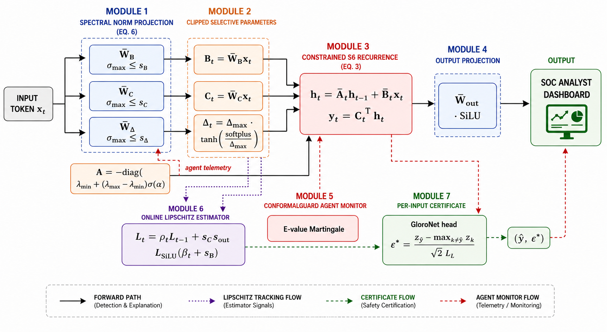

# LipMamba Architecture



```
                  ┌────────────────────────────────────────────────┐
                  │                LipMamba block                   │
                  │                                                │
  x_in ─► LayerNorm ─┬─►  W_x↑ ─► Conv1d ─► SiLU ──► SelectiveSSM ─┐
                    │                                              │
                    └─►  W_z↑ ─► SiLU ──────────────────► gate ────⊙
                                                                   │
                                                       W_out↓  ◄──┘
                                                          │
                                                          ▼
                                                       residual + x_in
```

## Selective state-space recurrence

```
α   ─► σ ─► [λ_min, λ_max] ─► A = -diag(λ)         (eigen_reparam.py)

          ┌──── spectral norm (one-step PI) ───┐
W_•  ────►│ W̄_•   with   ‖W̄_•‖₂ ≤ s_•           │   (spectral_norm.py)
          └────────────────────────────────────┘

x_t ─► W̄_Δ ─► softplus ─► / Δ_max ─► tanh ─► × Δ_max ─► Δ_t   (clipped_delta.py)

Ā_t = exp(Δ_t ⊙ A)         B̄_t = Δ_t ⊙ B_t

h_t = Ā_t ⊙ h_{t-1} + B̄_t · x_t                    (selective_ssm.py)
y_t = C̄_tᵀ h_t
```

## Network-level structure

* **Embedding** → tied with LM head.
* **N × LipMamba blocks** stacked.
* **Final LayerNorm** + **LM head** (always present).
* **Optional GloroNet head** for classification fine-tuning, exposing the
  per-input certified radius ε\*(x).

The variants in the paper:

```
LipMamba-130M : N=24 layers, d_model=768, d_inner=1536, L_SSM ≤ 5.0
LipMamba-370M : N=48 layers, d_model=1024, d_inner=2048, L_SSM ≤ 8.0
LipMamba-1.3B : N=64 layers, d_model=2048, d_inner=4096, L_SSM ≤ 12.0
```

`L_SSM` denotes the closed-form Lipschitz cap derived from the spectral
budgets and clipping constants — see [`THEORY.md`](THEORY.md).

## Cross-cutting design decisions

* **Spectral budgets are constants, not regularisers.** They are baked into
  the forward pass via spectral normalisation (Miyato et al. 2018), so the
  Lipschitz bound from Theorem 1 is *always* valid — even for an
  uncalibrated checkpoint mid-training.
* **Δ_t is positive and bounded by construction.** The
  `tanh(softplus(·)/Δ_max) · Δ_max` chain avoids the exploding-Δ failure
  mode that breaks naive Mamba-style training under adversarial inputs.
* **Eigenvalues are reparameterised, not clipped.** Clipping with a
  straight-through estimator gives gradient gaps; sigmoid reparameterisation
  is smooth and Lipschitz in α.
* **PAC-Bayes is the *only* generalisation tool used.** No DP-SGD, no
  mixup, no label smoothing — the manuscript shows a single PAC-Bayes term
  is enough to certify both clean and adversarial generalisation.
